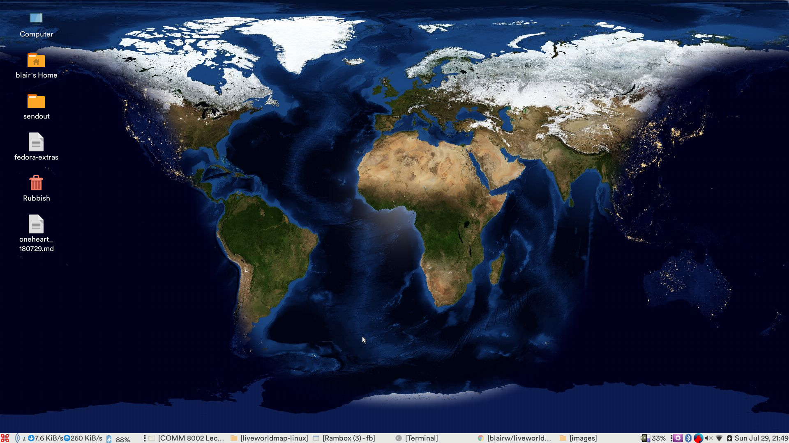

# Live World Map for Mac and Linux

## What is this?

A script that uses `xplanet` to make your desktop wallpaper a live map of the world using NASA imagery.



## How do I use this?

1. Install `xplanet` (use the correct line for your OS):  
	```bash
	sudo dnf install -y xplanet # Fedora
    brew cask install xplanet   # MacOS
	```
2. Clone the repository  
    ```bash
    cd ~/gitrepos # or wherever you keep this stuff
    git clone -v \
    	https://github.com/blairw/liveworldmap-linux
    ```
3. Edit the config files `config/config.conf` and `cronjob.sh` to point the correct paths for your setup
4. Open your crontab  
	```bash
	export EDITOR=nano # I don't like vim.. sorry..
	crontab -e
	```
5. Put in an entry for the script
    ```bash
    */5 * * * * /Users/blair/00blair/gitrepos/liveworldmap-linux/cronjob.sh
    ```

Happy wallpaper-cronning! :)

## I'm using Linux, but not Fedora

- If you're using MATE or GNOME you should be able to just edit `cronjob.sh` to suit your needs and use `apt-get` or whatever instead of `dnf`.

## Acknowledgements


- **Day imagery** `world.topo.bathy.200412.3x5400x2700.jpg`:  
	NASA (2004), 'Blue Marble Next Generation', _Visible Earth_, https://visibleearth.nasa.gov/view.php?id=73909
- **Night imagery** `dnb_land_ocean_ice.2012.3600x1800.jpg`:  
  NASA (2012), 'Night Lights 2012 - Flat Map', _Visible Earth_, https://visibleearth.nasa.gov/view.php?id=79765 
